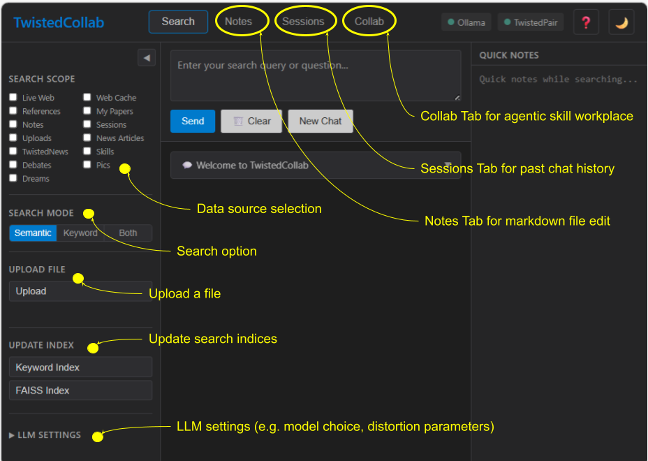

# TwistedCollab

## Local-First (*No Cloud Dependencies*) Agentic Research Assistant

Fully self-contained Web browser application to access, analyze, and act on data by ***collaborating*** with AI agents in multi-step agentic workflows, and special features from rhetorical ***TwistedPair*** distortion and data integration with ***TwistedDebate, TwistedDream, TwistedNews, and TwistedPic.*** Core functions include: RAG-powered chat, Markdown file edits and previews, live Web search, semantic and keyword search on local data sources, including personal documents, session history, notes, uploads, news articles, and various AI agent outputs.

Created: February 2026 · Updated: March 2026

## Target User and Objective

TwistedCollab is originally designed and built for my personal use to assist my daily scientific research activities, which mostly involve data, documents, and idea managament. Ideation and iteration are critical elements in research. I often revisit what I have read, thought, built, and written in the past, and ask myself questions on them from different perspectives at different times. Therefore, searching and reading data and documents alone is not sufficient. I need a tool that captures what I do everyday and allows me to access and act on them.

Many tasks I regulary perform require multiple steps with advanced linguistic processes. LLMs are very useful for this purpose. Since my work involve large volume of texts, data, and programs, the total token counts are quite large. Relying on cloud AI services adds up cost. Since everything I do remains in my local workstation, dealing with cloud storage is not ideal for me.

Therefore, the objective of TwistedCollab is to address these needs and constraints, serving as a personal agentic research assistant, providing a unified workbench to not only access but also to act on my data, documents, and ideas, and doing so completely locally without cloud dependencies.

Unlike LLM-based communication automation apps such as **OpenClaw**, TwistedCollab is about accessing and acting on local data by exploiting Twisted series applications that fully exploit LLM capabilities.  

---



---

## Data Sources

All data is indexed for keyword and semantic search

- **Live Web** — via Brave and DuckDuckGo Web Search APIs
- **Web Cache** — past Web search results
- **References** — research papers I collected over the years
- **My Papers** — my authored papers
- **Uploads** — any documents I uploaded
- **Sessions** — prompts to and respoonses from LLM agents
- **Notes** — markdown files I creat and edit
- **News Articles** — Global news articles automatically fetched daily by NewsAgent
- **TwistedNews** — Custom commentaries created by TwistedNews
- **Pics** — Metadata for images generated by twistedPic
- **Dreams** — Stories generated by TwistedDream
- **Debates** — Debate outputs generated by TwistedDebate
- **Skills** — Outputs from multi-step LLM agentic workflows

## Architecture

```
Browser (index.html + app.js)
        │  SSE / REST
        ▼
  server.py  (FastAPI)
  ├── ChatManager           ← session lifecycle, prompt assembly
  ├── RetrievalManager
  │   ├── FAISSIndexer      ← semantic search (IndexFlatIP per source)
  │   └── KeywordIndexer    ← FTS5 full-text search (SQLite)
  ├── WebSearchClient       ← Brave API + DDG fallback + caching
  ├── OllamaClient          ← LLM generation via Ollama REST API
  ├── TwistedPairClient     ← rhetorical distortion via TwistedPair V4
  └── Skill System
      ├── SkillRegistry     ← lazy-loads YAML skill definitions
      ├── SkillRunner       ← job queue, subprocess + RLIMIT_CPU
      ├── SkillOrchestrator ← sequential workflow executor
      └── Agents
          ├── SearchAgent         ← FAISS + keyword via /api/search
          ├── FilterAgent         ← LLM relevance scoring
          ├── SummarizationAgent  ← LLM synthesis
          ├── WebDiscoveryAgent   ← web search via /api/web-search
          └── ExtractionAgent     ← LLM source ranking + annotation

External services (local):
  Ollama       localhost:11434   (LLM inference)
  TwistedPair  localhost:8001    (text distortion)
```

## Prerequisites

| Requirement | Notes |
|---|---|
| Python 3.10+ | Tested on 3.10 |
| CUDA GPU | Required for FAISS embedding (`BAAI/bge-large-en-v1.5`) |
| [Ollama](https://ollama.com) | Running on `localhost:11434` |
| TwistedPair V2 | Running on `localhost:8001` (optional — distortion only) |
| Brave Search API key | Optional — falls back to DuckDuckGo |

---

## Installation

```bash
cd TwistedCollab
python -m venv .venv
source .venv/bin/activate
pip install -r requirements.txt
```

Copy and fill in the environment file:

```bash
cp .env.example .env
# Set BRAVE_API_KEY, OLLAMA_URL, TWISTEDPAIR_URL if non-default
```

## Configuration

All settings live in `config.py` and can be overridden via environment variables or `.env`.

| Variable | Default | Description |
|---|---|---|
| `OLLAMA_URL` | `http://localhost:11434` | Ollama server URL |
| `TWISTEDPAIR_URL` | `http://localhost:8001` | TwistedPair server URL |
| `BRAVE_API_KEY` | *(from .env)* | Brave Search API key |
| `DEFAULT_MODEL` | `ministral-3:14b` | Default Ollama model |
| `NUM_CTX` | `128000` | LLM context window (tokens) |
| `DEFAULT_OUTPUT_TOKENS` | `8000` | Default response token limit |
| `OLLAMA_KEEP_ALIVE` | `3m` | How long to hold model in GPU memory |
| `EMBEDDING_MODEL` | `BAAI/bge-large-en-v1.5` | Sentence embedding model |
| `EMBEDDING_DIM` | `1024` | Embedding vector dimension |
| `UNLOAD_EMBEDDER_AFTER_USE` | `True` | Free GPU after embedding queries |
| `CHILD_CHUNK_SIZE` | `500` | Tokens per chunk for FAISS indexing |
| `CHUNK_OVERLAP` | `100` | Overlap between consecutive chunks |

---

## Starting the Server

```bash
# 1. Ensure Ollama is running
ollama serve

# 2. (Optional) Start TwistedPair
cd ../TwistedPair/V2
uvicorn server:app --host 0.0.0.0 --port 8001

# 3. Start TwistedCollab
cd TwistedCollab
source .venv/bin/activate
uvicorn server:app --host 0.0.0.0 --port 8000 --reload
```

Open **http://localhost:8000** in a browser.

---

## User Interface

### Search Tab

The primary workspace. Three-column layout:

**Left: Collapsible Sidebar**
- **Search Scope** — compact 2-column checkbox grid to select which collections feed retrieval:
  - Live Web, Web Cache, References, My Papers, Notes, Sessions, Uploads, News Articles, TwistedNews, Skills, Debates, Pics, Dreams
- **Search Mode** — segmented button control (fits the 200 px sidebar):
  - `Semantic` — FAISS vector similarity (default)
  - `Keyword` — SQLite FTS5 full-text
  - `Both` — merged results, semantic first
- **Upload File** — add PDF/TXT/CSV/MD to the user_uploads collection
- **Update Index** — trigger FAISS or keyword re-indexing on demand
- **LLM Settings** *(collapsible)* — model, temperature, top-p, top-k, max tokens, context window, retrieval top-k
- **Distortion** *(inside LLM Settings)* — Mode, Tone, Gain slider, Ensemble mode, Conversation context toggle

**Center: Chat**
- Query textarea — `Send` (Ctrl+Enter), `Clear`, `New Chat`
- Token-streaming responses via Server-Sent Events
- Each exchange collapsible; shows question, streamed answer, retrieved source citations

**Right: Quick Notes**
- Mini scratchpad always visible alongside chat for jotting during research

### Notes Tab

Full Markdown editor:
- **Three view modes**: Edit / Split (side-by-side preview) / Preview — toolbar or `Ctrl+E`
- **File operations**: New, Open (server-side file browser), Save (`Ctrl+S`), Download (`Ctrl+Shift+S`), Close
- **Auto-save** every 30 seconds when unsaved changes are present
- Files saved to `data/markdown/notes/` and indexed as the Notes search source
- Unsaved-change indicator (● in filename bar), live character count

### Sessions Tab

- Reverse-chronological list of all past conversations
- Click any session to resume it (full message history restored)
- Live filter box to search session titles and previews
- Sessions stored as JSON + Markdown in `data/sessions/`

### Collab Tab

The **Agentic Skill Runner**. Executes multi-step LLM workflows driven by YAML skill definitions.

**Left sidebar:**
- **Skill Library** — all registered skills loaded from `skills/*.yaml`; click a card to select
- **Parameters** — dynamically rendered form for each skill's declared parameters
  - `str` / `int` → text or number input with min/max constraints
  - `dict` (e.g. `search_scope`) → compact 2-column checkbox grid, one checkbox per key (mirrors the Search Scope layout in the Search tab)
- **Run Skill** — disabled while a job is running (single-run guard)
- **Recent Jobs** — last 5 jobs with status badge; click a completed job to restore its output

**Main panel:**
- Step-by-step progress bar with spinner → checkmark transitions (SSE-driven)
- Live status message showing current agent and action
- Rendered Markdown report with **Copy Report** button
- Source list (with clickable links for web-sourced results)
- Output persists when switching away and back to the tab

**Right sidebar:**
- **Saved Results** — all previously generated skill outputs, newest first
- Click any item to reload its Markdown into the main panel
- Hover-reveal ✕ delete button with confirmation
- Auto-refreshes after every completed skill run

Completed skill results are automatically saved as Markdown files to `data/markdown/skills/`.

---

## Agentic Skill System

The skill system lets you define and run multi-step LLM workflows entirely through the Collab tab UI, with live progress feedback and persistent output.

### Concepts

| Concept | Description |
|---|---|
| **Skill** | A named workflow declared in a YAML file under `skills/`. Defines parameters, agent roles, and step order. |
| **Agent** | A Python class that implements one specific action (e.g. web search, LLM scoring). Stateless; communicates only via HTTP. |
| **Orchestrator** | Executes steps sequentially, passing each step's output into the next step's inputs via a shared context dict. |
| **Runner** | Manages a job queue; each skill run executes in a daemon thread with resource limits. |

### Built-in Skills

#### `literature_review`
Automated 3-step literature review over your indexed document collections.

| Parameter | Type | Default | Description |
|---|---|---|---|
| `topic` | str | — | Research topic (required) |
| `max_papers` | int | 20 | Papers retrieved in initial search (5–50) |
| `top_n` | int | 10 | Top-scored papers passed to synthesizer (3–20) |
| `search_scope` | dict | refs + my papers | Which FAISS/FTS5 indices to search (reference_papers, my_papers, sessions, web_cache, notes, user_uploads, news_articles, twistednews, skills, debates, pics, dreams) |

**Steps:** `search_agent` → `filter_agent` → `summarization_agent`

**Output:** Structured Markdown report with Executive Summary, Key Themes, Synthesis, Gaps, and Conclusion, plus a ranked source list.

---

#### `literature_discovery`
Discovers new sources via live web search, then ranks and annotates them with an LLM.

| Parameter | Type | Default | Description |
|---|---|---|---|
| `topic` | str | — | Research topic (required) |
| `site_filter` | str | *(open web)* | Restrict to a domain, e.g. `arxiv.org`, `pubmed.ncbi.nlm.nih.gov` |
| `num_results` | int | 20 | Web results to retrieve (5–50) |
| `top_n` | int | 15 | Top-ranked sources to return (3–30) |

**Steps:** `web_discovery_agent` → `extraction_agent`

**Output:** Ranked list of sources with title, URL, relevance score (0–10), and one-sentence annotation per source.

---

### Built-in Agents

| Role | File | Action | Uses |
|---|---|---|---|
| `search_agent` | `agents/search_agent.py` | `search_literature` | `POST /api/search` (FAISS + FTS5) |
| `filter_agent` | `agents/filter_agent.py` | `filter_by_relevance` | Ollama LLM — scores 0–10 |
| `summarization_agent` | `agents/summarization_agent.py` | `synthesize` | Ollama LLM — structured 5-section review |
| `web_discovery_agent` | `agents/web_discovery_agent.py` | `discover_sources` | `POST /api/web-search` (Brave/DDG) |
| `extraction_agent` | `agents/extraction_agent.py` | `extract_sources` | Ollama LLM — ranks + annotates results |

### Adding a New Skill

Three steps, no server restart required:

**1. Create an agent** (if a new action is needed):
```python
# agents/my_agent.py
from agents.base_agent import BaseAgent

class MyAgent(BaseAgent):
    role = "my_agent"

    def run_action(self, action, inputs):
        if action == "my_action":
            return self._do_something(inputs)
        raise ValueError(f"Unknown action: {action}")
```

**2. Register it** in `agents/registry.py` → `register_all_agents()`:
```python
from agents.my_agent import MyAgent
AgentRegistry.register(MyAgent)
```

**3. Create a YAML skill definition** in `skills/my_skill.yaml`:
```yaml
name: my_skill
version: "1.0"
description: "What this skill does."
parameters:
  topic:
    type: str
    required: true
agents:
  - role: my_agent
    name: "My Step"
workflow:
  pattern: sequential
  steps:
    - step: 1
      agent: my_agent
      action: my_action
      output: final_report
security:
  max_execution_time: 300
  max_memory_mb: 256
```

Then hot-reload without restarting the server:
```bash
curl -X POST http://localhost:8000/api/skills/reload
```

### Skill YAML Parameter Types

| `type` | UI element | Notes |
|---|---|---|
| `str` | Text input | Set `required: true` to enforce |
| `int` | Number input | Respects `min_value` / `max_value` |
| `str` with `allowed_values` | Dropdown select | List valid options |
| `dict` | Checkbox grid | Each key becomes a labelled checkbox; defaults set initial state |

### Saved Results

Every completed skill run is automatically saved to `data/markdown/skills/` as:
```
<skill_name>_<topic>_<YYYYMMDD_HHMMSS>.md
```
The file contains the full report, source list, and a parseable `<!-- meta ... -->` comment used by the history panel.


### Semantic Search (FAISS)

Implemented in `faiss_indexer.py` (`FAISSIndexer`).

- One `IndexFlatIP` (inner product = cosine similarity on L2-normalised vectors) per source
- Embedder: `BAAI/bge-large-en-v1.5` (1024-dim), GPU-accelerated, unloaded after use
- Incremental updates via MD5 file-hash tracking — only new/changed files re-embedded
- Metadata stored as pickle list of chunk dicts

Chunking: `SimpleChunker` — tiktoken `cl100k_base`, 500-token chunks, 100-token overlap.

### Keyword Search (SQLite FTS5)

Implemented in `keyword_indexer.py` (`KeywordIndexer`).

- SQLite FTS5 with Porter stemmer and unicode61 tokenizer
- Per-source indexing matching the FAISS source set
- **Recursive directory scan** (`rglob`) — indexes files in nested subdirectories (required for sources like Dreams whose outputs are stored one-per-subfolder)
- Incremental updates via MD5 file-hash tracking
- Returns highlighted snippets with `<mark>` tags (stripped before LLM context assembly)
- Thread-safe via `threading.Lock`

### Search Mode Selector

The segmented button group in the sidebar controls retrieval for both chat RAG and direct `/api/search` calls:

| Mode | Behaviour |
|---|---|
| `Semantic` | FAISS cosine similarity only (default) |
| `Keyword` | SQLite FTS5 only |
| `Both` | Semantic results first, keyword results appended |

---

## RAG Pipeline

When a message is sent with at least one data source checked:

1. **Retrieval** — `RetrievalManager` runs the selected search mode across checked sources
2. **Context assembly** — top-k results → `ContextItem` objects (snippet ≤ 300 chars)
3. **Web search** (if enabled) — live results appended to context
4. **Uploaded documents** — full content prepended if files were uploaded in the session
5. **Prompt construction** — `ChatManager` builds system prompt with all context + conversation history
6. **Streaming generation** — `OllamaClient.chat_stream()` streams tokens via SSE
7. **Distortion** (if enabled) — full response passed through `TwistedPairClient.distort()` before display
8. **Session save** — exchange auto-saved to JSON; session auto-indexed on close

---

## TwistedPair Distortion

TwistedPair is a separate local REST service for rhetorical reframing. Configured per-session in LLM Settings.

**6 Modes:**

| Mode | Effect |
|---|---|
| Off | No distortion (default) |
| Echo-er | Amplifies positives, affirming framing |
| Invert-er | Negates signals, challenges assumptions |
| What-if-er | Explores counterfactuals and alternatives |
| So-what-er | Demands implications and consequences |
| Cucumb-er | Cool academic / analytical register |
| Archiv-er | Historical context and precedent |

**5 Tones:** Neutral · Technical · Primal · Poetic · Satirical

**Gain:** 1–10 (distortion intensity)

**Ensemble Mode:** All 6 modes applied simultaneously; responses returned as a structured set.

---

## Web Search

`WebSearchClient` in `web_search.py`:

1. **Primary**: Brave Search API (`BRAVE_API_KEY` required)
2. **Fallback**: DuckDuckGo via `ddgs` (no key required)
3. Each result URL fetched, BeautifulSoup-parsed, truncated to `WEB_FETCH_MAX_CHARS`
4. Results cached to `data/web_cache/` as JSON + Markdown
5. Cache auto-indexed into FAISS and keyword indices for future retrieval

---

## Index Management

### From the UI (sidebar)

- **Keyword Index** button → `POST /api/update-keyword-index`
- **FAISS Index** button → `POST /api/update-faiss-index`

Both accept `sources` (list, defaults to all) and `force` (full rebuild flag).

### Command Line

```bash
python build_runtime_indices.py          # Build all FAISS indices
python MRA_v3_4_verify_index.py          # Verify index integrity
```

### Auto-Indexing (config.py)

| Flag | Default | Effect |
|---|---|---|
| `AUTO_INDEX_SESSIONS` | `True` | Index session when closed |
| `AUTO_INDEX_WEB_CACHE` | `True` | Index web result after caching |
| `AUTO_INDEX_PAPERS` | `False` | Papers require explicit rebuild |

---

## Session Management

Each session is identified by a UUID:

```
data/sessions/
├── session_<uuid>_<timestamp>.json   ← full conversation + metadata
└── session_<uuid>_<timestamp>.md     ← Markdown summary for search indexing
```

Sessions are resumable from the Sessions tab. Closed sessions are auto-indexed so their content becomes searchable in future conversations.

---

## API Reference

| Method | Endpoint | Description |
|---|---|---|
| POST | `/api/chat/message/stream` | Streaming SSE chat with RAG |
| POST | `/api/chat/end-session` | Close and save session |
| GET | `/api/sessions` | List all sessions |
| GET | `/api/sessions/{id}` | Get session details |
| POST | `/api/search` | Direct search (semantic/keyword/both) |
| POST | `/api/web-search` | Live web search |
| POST | `/api/distort` | Direct TwistedPair distortion |
| POST | `/api/update-faiss-index` | Build/update FAISS indices |
| POST | `/api/update-keyword-index` | Build/update FTS5 indices |
| POST | `/api/upload` | Upload file to user_uploads |
| GET | `/api/notes` | List saved notes |
| GET | `/api/notes/{filename}` | Load a note |
| PUT | `/api/notes/{filename}` | Save a note |
| GET | `/api/health` | Health — Ollama, TwistedPair, embedder, GPU |
| POST | `/api/skills/run/stream` | Run a skill with SSE progress stream |
| POST | `/api/skills/run` | Submit skill as async job (returns job_id) |
| GET | `/api/skills/status/{job_id}` | Poll job status and result |
| GET | `/api/skills/list` | List all registered skill definitions |
| GET | `/api/skills/jobs` | List all skill jobs |
| POST | `/api/skills/reload` | Hot-reload skill YAML files from disk |
| GET | `/api/skills/results` | List saved skill result Markdown files |
| GET | `/api/skills/results/{filename}` | Read a saved skill result |
| DELETE | `/api/skills/results/{filename}` | Delete a saved skill result |

### Key Chat Request Fields

```json
{
  "session_id": "new",
  "message": "...",
  "use_rag": true,
  "search_mode": "semantic",
  "search_scope": {
    "reference_papers": true,
    "my_papers": false,
    "sessions": false,
    "web_cache": false,
    "notes": false,
    "user_uploads": false,
    "news_articles": false,
    "twistednews": false,
    "skills": false,
    "debates": false,
    "pics": false,
    "dreams": false
  },
  "use_web_search": false,
  "model": "ministral-3:14b",
  "temperature": 0.7,
  "max_tokens": 8000,
  "num_ctx": 128000,
  "top_k_retrieval": 20,
  "use_distortion": false,
  "distortion_mode": "cucumb_er",
  "distortion_tone": "neutral",
  "distortion_gain": 5
}
```

---

## Data Directory Layout

```
TwistedCollab/
├── data/
│   ├── markdown/
│   │   ├── reference_papers/   ← converted PDFs from MyReferences
│   │   ├── my_papers/          ← converted PDFs from MyAuthoredPapers
│   │   ├── notes/              ← saved Markdown notes
│   │   ├── skills/             ← auto-saved skill result Markdown files
│   │   ├── user_uploads/       ← files uploaded via UI
│   │   ├── news_articles/      ← news from NewsAgent
│   │   └── twistednews/        ← rhetorical news from TwistedNews
│   ├── sessions/               ← chat session JSON + MD files
│   └── web_cache/              ← cached web search results
│
│  External sources (outside TwistedCollab, configurable via env vars):
├── ../TwistedDebate/outputs/   ← debate Markdown files  (SOURCE_DEBATES_DIR)
├── ../TwistedPic/outputs/      ← TwistedPic metadata JSON files (SOURCE_PICS_DIR)
└── ../TwistedDream/outputs/    ← storybook_<timestamp>.md per subfolder (SOURCE_DREAMS_DIR)
├── faiss_indices/
│   ├── <source>.index          ← FAISS IndexFlatIP (one per source)
│   ├── <source>.metadata       ← chunk metadata (pickle list)
│   └── <source>.stats          ← JSON stats (chunks, docs, last_updated)
├── data/keyword_index.db       ← SQLite FTS5 database
├── static/
│   ├── index.html
│   ├── app.js
│   └── styles.css
└── models/                     ← reserved for local model files
```

---

## Module Reference

| File | Role |
|---|---|
| `server.py` | FastAPI app, all REST endpoints, request/response models |
| `chat_manager.py` | Session lifecycle, message history, prompt construction |
| `retrieval_manager.py` | Unified interface to FAISS + keyword search |
| `faiss_indexer.py` | Single-stage FAISS builder, searcher, incremental updater |
| `keyword_indexer.py` | SQLite FTS5 builder and searcher |
| `ollama_client.py` | Ollama REST API wrapper (generate, chat, stream, health) |
| `twistedpair_client.py` | TwistedPair V4 REST client (distort, is_healthy) |
| `web_search.py` | Brave + DDG search, URL fetch, result caching |
| `auto_indexer.py` | Automatic indexing of sessions and web cache at runtime |
| `build_runtime_indices.py` | CLI script to build all indices from scratch |
| `config.py` | All configuration constants and directory setup |
| `errors.py` | Shared exception types and retry decorator |
| `utils/embedder.py` | `BAAI/bge-large-en-v1.5` embedding wrapper |
| `agents/base_agent.py` | Abstract base for all agents — `_search()`, `_llm_chat()` helpers |
| `agents/registry.py` | Maps role strings → agent classes; `register_all_agents()` |
| `agents/orchestrator.py` | Sequential workflow executor with SSE progress callbacks |
| `agents/runner.py` | Job queue + daemon thread execution with resource limits |
| `agents/worker.py` | Subprocess entry point (`python -m agents.worker`) |
| `agents/search_agent.py` | FAISS + keyword retrieval agent |
| `agents/filter_agent.py` | LLM relevance scoring agent |
| `agents/summarization_agent.py` | LLM literature review synthesis agent |
| `agents/web_discovery_agent.py` | Web search agent with optional site: filter |
| `agents/extraction_agent.py` | LLM source ranking and annotation agent |
| `skills/skill_schema.py` | Pydantic models for YAML skill definitions |
| `skills/skill_registry.py` | Lazy YAML loader and cache for skill definitions |
| `skills/literature_review.yaml` | 3-step literature review skill definition |
| `skills/literature_discovery.yaml` | 2-step web discovery + extraction skill definition |

---

## Environment Variables

| Variable | Description |
|---|---|
| `OLLAMA_URL` | Ollama server (default: `http://localhost:11434`) |
| `TWISTEDPAIR_URL` | TwistedPair server (default: `http://localhost:8001`) |
| `BRAVE_API_KEY` | Brave Search API key |
| `OLLAMA_KEEP_ALIVE` | GPU keep-alive duration (default: `3m`) |
| `LOG_LEVEL` | Logging level (default: `INFO`) |
| `TWISTED_DEBATES_DIR` | Path to TwistedDebate outputs (default: `../TwistedDebate/outputs`) |
| `TWISTED_PICS_DIR` | Path to TwistedPic outputs (default: `../TwistedPic/outputs`) |
| `TWISTED_DREAMS_DIR` | Path to TwistedDream outputs (default: `../TwistedDream/outputs`) |

---

## License

MIT License

## Created and last updated

Created: February 22, 2026  
Last updated: March 22, 2026 — expanded Search Scope to 13 sources (Skills, Debates, Pics, Dreams); renamed sidebar section; compact 2-column scope grid; recursive keyword indexer (`rglob`); external source directories for TwistedDebate, TwistedPic, TwistedDream outputs configurable via env vars; TwistedDream now emits `storybook_<timestamp>.md` companion files for automatic indexing
